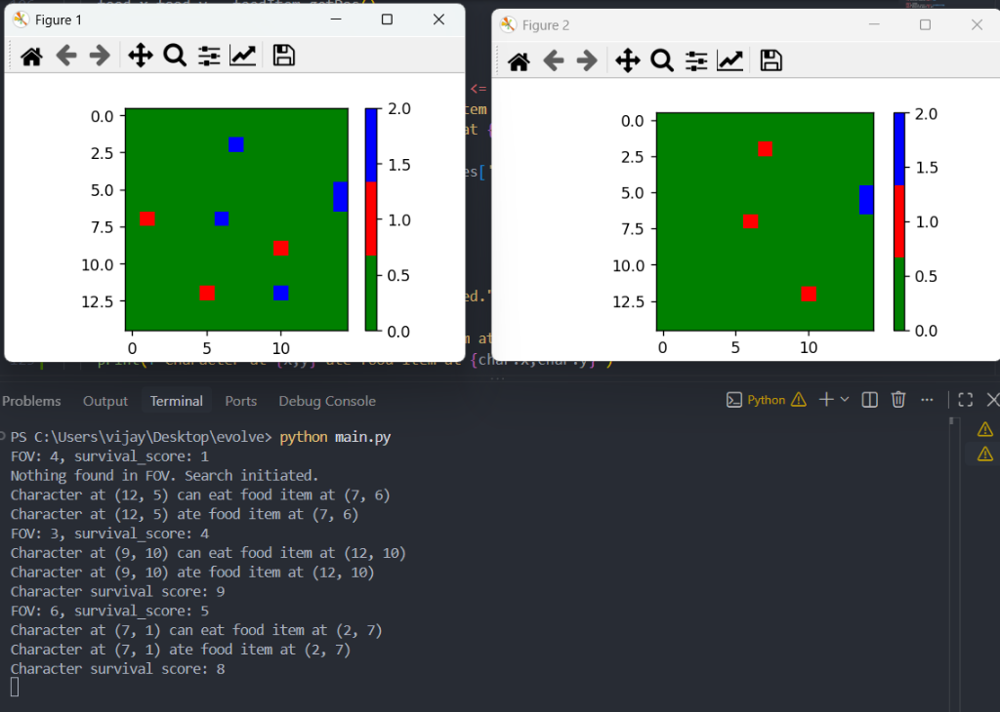

# 🧬 PRIMAL — Evolution & Natural Selection Simulation

> An agent-based artificial life simulation modeling natural selection, genetic diversity, trait inheritance, and ecosystem dynamics in a 2D environment.

---

## 🌍 Overview & Vision

**PRIMAL** is an evolutionary simulation inspired by Darwinian theory and computational biology. The project models how autonomous digital organisms—each equipped with unique physical and behavioral traits—interact, compete, survive, and evolve inside a shared ecosystem.

By introducing environmental pressures such as finite resources, sensory limitations, and competitive interactions, the simulation demonstrates how complex emergent behaviors arise from simple biological rules.

---

## 🔬 Core Mechanics

### 1. The Environment (Perimeter Matrix)
The simulation takes place on a configurable two-dimensional grid representing a bounded habitat. Organisms and consumable resources coexist within this coordinate space, forming an active testing ground for evolutionary pressures.

### 2. Specimen Architecture & Trait System
Every specimen spawned into the environment is assigned distinct biological attributes that influence its survival capabilities:

* **Speed (⚡)**: Dictates foraging priority and navigation speed toward resources.
* **Strength (💪)**: Determines the outcome of physical confrontations and competitive resource disputes.
* **Aggression (👹)**: Governs behavioral tendencies—influencing whether an organism prioritizes passive foraging or hostile competition against rivals.
* **Field of View (👁️)**: Sensory vision radius defining how far an organism can scan for provisions in the surrounding grid.
* **Survival Score / Vitality (❤️)**: Dynamic vitality rating tracking organism health, incremented upon consuming nutritional food items and depleted by movement.
* **Spatial Coordinates (📍)**: Real-time tracking of organism positioning across the matrix.

### 3. Resource Ecology (Food System)
Nutritional resources are scattered across the terrain to fuel specimen survival. Each food item carries a distinct **Food Score (🍎)** representing its nutritional and energy yield. Competition for these limited provisions forms the primary evolutionary catalyst for natural selection.

### 4. Real-Time Visual Observation
The ecosystem state is rendered graphically onto a 2D coordinate plot, utilizing full-perimeter terrain graphics, coordinate rulers, and layered entity sprites in real time.

---

## 🗺️ Evolutionary Roadmap

The development of **PRIMAL** is structured across progressive evolutionary phases:

### 🌱 Phase 1: Spawning & Resource Ecology *(Completed)*
* ✅ Initialization of the two-dimensional spatial perimeter.
* ✅ Randomized entity generation with variable baseline attributes (Speed, Strength, Aggression).
* ✅ Distribution of food items across random coordinate locations.
* ✅ Graphical visualization of specimens and resources on a coordinate plane.

### 👁️ Phase 2: Sensory Perception & Movement *(Completed)*
* ✅ Implementation of a Field of View (FOV) radius for each specimen.
* ✅ Proximity detection and sensory scanning algorithm to locate food items within FOV.
* ✅ Fallback searching algorithm (recursive matrix exploration) for specimens when food is outside FOV.
* ✅ Resource consumption and dynamic survival score accumulation.
* ✅ Directional multi-step pathfinding and autonomous movement mechanics toward detected targets.

### 💻 Phase 3: Interactive Web Platform, Animation Pipeline & Mortality Dynamics *(In Progress)*
* ✅ Transition from static Matplotlib plotting to full-stack Python Flask + Vanilla HTML/CSS/JS web platform.
* ✅ 16-bit retro naturalist terrarium interface with 3-column workstation layout.
* ✅ Step-by-step path interpolation and movement animation.
* ✅ Step energy cost (-1 Vitality per step) with floating indicators.
* ✅ Mortality threshold: Organisms with Vitality < 3 succumb to exhaustion with red critical death disintegration.
* 🔄 Multi-day persistence and day-to-day carrying capacity tracking.

### 🧬 Phase 4: Reproduction & Genetic Inheritance
* Energy storage thresholds required for reproduction.
* Trait transmission from parent organisms to offspring.
* Introduction of genetic mutations to drive diversity and trait drift.

### ⚔️ Phase 5: Competition & Natural Selection
* Interaction dynamics when specimens contest the same resource.
* Combat and dominance resolution determined by Strength and Aggression ratios.
* Survival of the fittest: organisms with advantageous trait combinations reproduce more successfully.

### 💀 Phase 6: Mortality & Population Dynamics
* Natural lifespan limits and specimen decay over generational cycles.
* Population equilibrium tracking and carrying capacity analysis.

---

## 📓 Development Journey

### Day 01 — Genesis: Grid Foundation & Entity Spawning
* Established the core 10x10 spatial perimeter for the ecosystem.
* Built the initial character class with randomized physical attributes: Speed (1–7), Strength (1–6), and Aggression (1–9).
* Implemented food item generation and spatial mapping.
* Connected the simulation state to a graphical visualization pipeline using Matplotlib to display emoji-based specimen markers at their exact coordinates.
* **Next Objective**: Implement sensory FOV calculation so organisms can actively detect and navigate toward nearby sustenance.

---

### Day 02 — Sensory Perception, Nutritional Yield & Fallback Search Algorithm
* **Nutritional Scoring for Resources**: Introduced `foodScore` (range 2–7) to individual `Food` entities, quantifying the energy return of each food source.
* **Survival Score Trait for Organisms**: Added dynamic `survival_score` (initialized 1–5) to `Character` attributes to track organism vitality.
* **Field of View (FOV) Sensory Detection**: Implemented randomized specimen vision radii (`fov` range 3–7) and a spatial boundary detection algorithm:
  $$\Delta x \le \text{FOV} \quad \text{and} \quad \Delta y \le \text{FOV}$$
* **Target Acquisition & Consumption**: Enabled organisms to identify target food items within their sensory perimeter, consume them, absorb their nutritional value into `survival_score`, and update grid coordinates dynamically.
* **Fallback Searching Algorithm (Out-of-FOV Exploration)**: Implemented a recursive spatial search (`searchFood`) using depth-first matrix exploration and a `visited` coordinate set. When no food is detected within a specimen's FOV, the organism triggers a fallback search across cardinal grid directions (Up, Down, Left, Right) to locate and acquire nourishment across the matrix.
* **Expanded Environment & Dual-State Visual Output**: Scaled the perimeter matrix to 15x15 with Matplotlib `ListedColormap` rendering (Green: Empty terrain, Red: Characters, Blue: Food items) and dual-figure visualization tracking the ecosystem state before (Figure 1) and after (Figure 2) foraging and search execution.



* **Next Objective**: Implement multi-step directional pathfinding toward out-of-range targets and multi-character resource competition dynamics.

---

### Day 03 — Interactive Web Platform, 16-Bit Terrarium UI, Step Traversal & Mortality Dynamics
* **Interactive Web Simulation Platform (Flask + Vanilla JS)**:
  - Replaced Matplotlib CLI visualization with a full-stack web simulation powered by a Python Flask REST API (`/api/state`, `/api/next-day`, `/api/reset`, `/api/config`) and a zero-dependency HTML5/CSS3/Vanilla JS frontend.
* **16-Bit Retro Naturalist Terrarium UI**:
  - Designed a 1990s expedition field desk theme featuring a deep forest green, heartwood timber, and aged parchment color palette with 90° stepped drop shadows.
  - Built a 3-column workstation layout: **Expedition Toolkit** (controls, solar rate slider, habitat regulator, presets), **Oak Frame Vitrine** (coordinate rulers, full-perimeter canvas, camera tools), and **Naturalist Ledger & DNA Dossier** (census, segmented biomass meter, allele trait bars).
* **Step-by-Step Movement & Path Interpolation**:
  - Eliminated abrupt teleportation; organisms smoothly traverse step-by-step across calculated grid paths.
* **Vitality Depletion & Critical Mortality Threshold**:
  - Organisms expend energy while moving: each step costs **1 Vitality (Survival Score)** with floating `-1 ❤️` indicators.
  - If vitality drops below **3**, the specimen succumbs to exhaustion and is removed from the habitat with a red critical death disintegration animation.
* **Sensory Perception & Fallback DFS Search**:
  - Implemented Chebyshev Field of View (FOV) scanning and fallback recursive Depth-First Search (DFS) with animated exploration sonar trails.
* **Visual Asset Scaling & Alignment**:
  - Trees rendered as 2x2 expansive canopies (`190%` scale).
  - Organisms enlarged to `190%` for crisp sprite visibility.
  - Food items rendered as compact nutritional deposits (`80%`).
  - Y-axis coordinate ruler numbers aligned with grid rows.

---

## 🚀 Running the Web Simulation

1. **Install dependencies**:
   ```bash
   pip install -r requirements.txt
   ```

2. **Start the simulation server**:
   ```bash
   python app.py
   ```

3. **Open the browser**:
   Navigate to `http://127.0.0.1:5000/`
