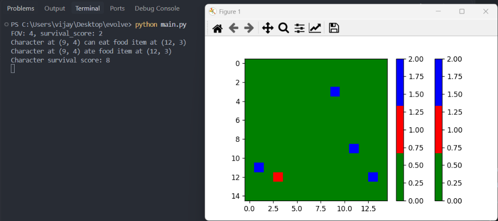

# 🧬 PRIMAL — Evolution & Natural Selection Simulation

> An agent-based artificial life simulation modeling natural selection, genetic diversity, trait inheritance, and ecosystem dynamics in a 2D environment.

---

## 🌍 Overview & Vision

**PRIMAL** is an evolutionary simulation inspired by Darwinian theory and computational biology. The project models how autonomous digital organisms—each equipped with unique physical and behavioral traits—interact, compete, survive, and evolve inside a shared ecosystem.

By introducing environmental pressures such as finite resources, sensory limitations, and competitive interactions, the simulation demonstrates how complex emergent behaviors arise from simple biological rules.

---

## 🔬 Core Mechanics

### 1. The Environment (Perimeter Matrix)
The simulation takes place on a configurable two-dimensional grid representing a bounded habitat. Organisms and consumable resources coexist within this coordinate space, forming an active testing ground for evolutionary pressures.

### 2. Specimen Architecture & Trait System
Every specimen spawned into the environment is assigned distinct biological attributes that influence its survival capabilities:

* **Speed (⚡)**: Dictates how quickly the specimen navigates the grid toward resources or away from threats.
* **Strength (💪)**: Determines the outcome of physical confrontations and competitive resource disputes.
* **Aggression (👹)**: Governs behavioral tendencies—influencing whether an organism prioritizes passive foraging or hostile competition against rivals.
* **Field of View (👁️)**: Sensory vision radius defining how far an organism can scan for provisions in the surrounding grid.
* **Survival Score (❤️)**: Dynamic vitality rating tracking organism health, incremented upon consuming nutritional food items.
* **Spatial Coordinates (📍)**: Real-time tracking of organism positioning across the matrix.

### 3. Resource Ecology (Food System)
Nutritional resources are scattered across the terrain to fuel specimen survival. Each food item carries a distinct **Food Score (🍎)** representing its nutritional and energy yield. Competition for these limited provisions forms the primary evolutionary catalyst for natural selection.

### 4. Real-Time Visual Observation
The ecosystem state is rendered graphically onto a 2D coordinate plot, utilizing distinct visual colormaps and coordinate matrices to represent terrain, specimens, and resources in real time.

---

## 🗺️ Evolutionary Roadmap

The development of **PRIMAL** is structured across progressive evolutionary phases:

### 🌱 Phase 1: Spawning & Resource Ecology *(Completed)*
* Initialization of the two-dimensional spatial perimeter.
* Randomized entity generation with variable baseline attributes (Speed, Strength, Aggression).
* Distribution of food items across random coordinate locations.
* Graphical visualization of specimens and resources on a coordinate plane.

### 👁️ Phase 2: Sensory Perception & Movement *(In Progress)*
* ✅ Implementation of a Field of View (FOV) radius for each specimen.
* ✅ Proximity detection and sensory scanning algorithm to locate food items within FOV.
* ✅ Resource consumption and dynamic survival score accumulation.
* 🔄 Directional multi-step pathfinding and autonomous movement mechanics toward detected targets.

### 🧬 Phase 3: Reproduction & Genetic Inheritance
* Energy storage thresholds required for reproduction.
* Trait transmission from parent organisms to offspring.
* Introduction of genetic mutations to drive diversity and trait drift.

### ⚔️ Phase 4: Competition & Natural Selection
* Interaction dynamics when specimens contest the same resource.
* Combat and dominance resolution determined by Strength and Aggression ratios.
* Survival of the fittest: organisms with advantageous trait combinations reproduce more successfully.

### 💀 Phase 5: Mortality & Population Dynamics
* Energy depletion and starvation mechanics over elapsed simulation steps.
* Natural lifespan limits and specimen decay.
* Population equilibrium tracking and carrying capacity analysis.

---

## 📓 Development Journey

### Day 01 — Genesis: Grid Foundation & Entity Spawning
* Established the core 10x10 spatial perimeter for the ecosystem.
* Built the initial character class with randomized physical attributes: Speed (1–7), Strength (1–6), and Aggression (1–9).
* Implemented food item generation and spatial mapping.
* Connected the simulation state to a graphical visualization pipeline using Matplotlib to display emoji-based specimen markers at their exact coordinates.
* **Next Objective**: Implement sensory FOV calculation so organisms can actively detect and navigate toward nearby sustenance.

---

### Day 02 — Sensory Perception, Nutritional Yield & FOV Foraging
* **Nutritional Scoring for Resources**: Introduced `foodScore` (range 2–7) to individual `Food` entities, quantifying the energy return of each food source.
* **Survival Score Trait for Organisms**: Added dynamic `survival_score` (initialized 1–5) to `Character` attributes to track organism vitality.
* **Field of View (FOV) Sensory Detection**: Implemented randomized specimen vision radii (`fov` range 3–7) and a spatial boundary detection algorithm:
  $$\Delta x \le \text{FOV} \quad \text{and} \quad \Delta y \le \text{FOV}$$
* **Target Acquisition & Consumption**: Enabled organisms to identify target food items within their sensory perimeter, consume them, absorb their nutritional value into `survival_score`, and update grid coordinates dynamically.
* **Expanded Environment & Colormap Rendering**: Scaled the perimeter matrix to 15x15 and integrated Matplotlib `ListedColormap` visualization (Green: Empty terrain, Red: Characters, Blue: Food items).

* **Next Objective**: Implement multi-step directional pathfinding toward out-of-range targets and multi-character resource competition dynamics.

---
